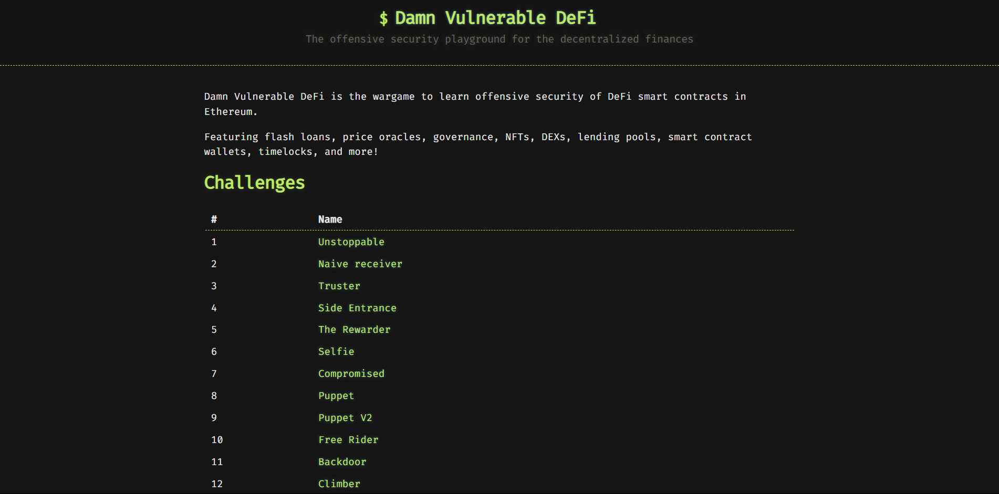
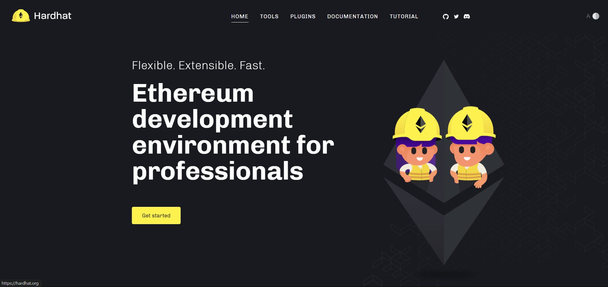

## Damn-Vulnerable-DeFi All Write-up (Jun 19, 2024)

To study and research DeFi protocols risks, I share [Damn-Vulnerable-DeFi](https://www.damnvulnerabledefi.xyz/) all solve code.

I think it is a useful reference for many people when studying.

## Getting Started

The codes are based on the [hardhat](https://hardhat.org/) framework, which makes more smart contract builds easy.

So, in order to use the code, hardhat must be installed by default, and then run the code.

