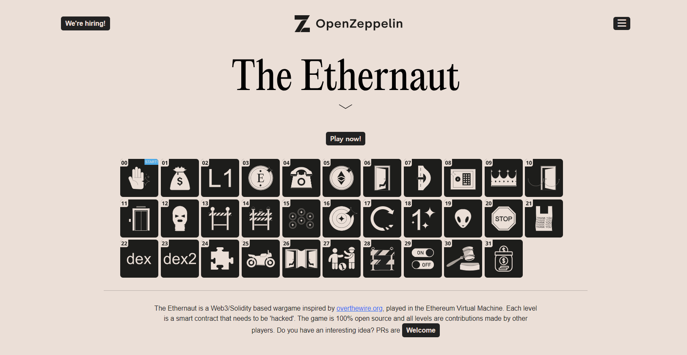
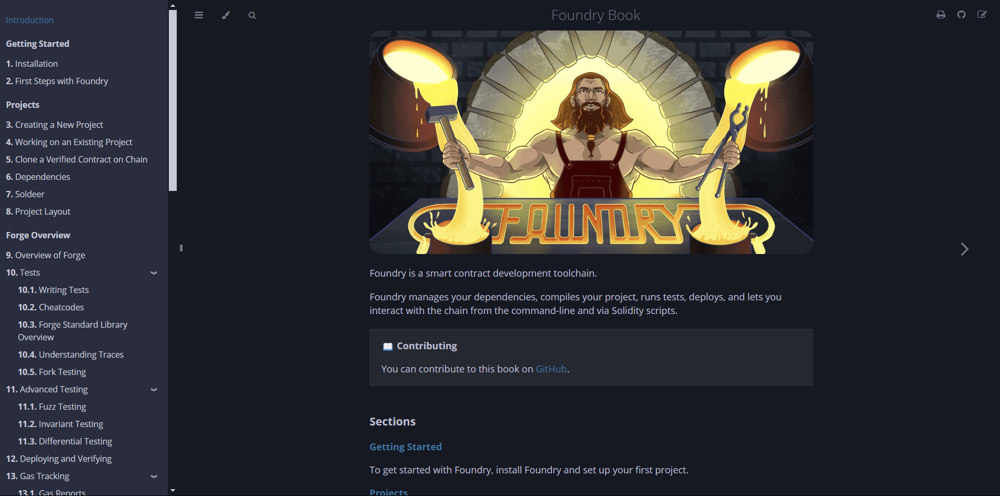

## Ethernaut All Write-up (Jun 5, 2024)



This repository shares solutions and write-ups for all levels of [Ethernaut](https://ethernaut.openzeppelin.com/), a blockchain wargame created by OpenZeppelin.  
It is a valuable reference for anyone studying blockchain vulnerabilities.

- [Level 00: Hello Ethernaut solve](./script/0_Hello_Ethernaut_solve.sol)
- [Level 01: Fallback solve](./script/1_Fallback_solve.sol)
- [Level 02: Fallout solve](./script/2_Fallout_solve.sol)
- [Level 03: Coin Flip solve](./script/3_Coin_Flip_solve.sol)
- [Level 04: Telephone solve](./script/4_Telephone_solve.sol)
- [Level 05: Token solve](./script/5_Token_solve.sol)
- [Level 06: Delegation solve](./script/6_Delegation_solve.sol)
- [Level 07: Force solve](./script/7_Force_solve.sol)
- [Level 08: Vault solve](./script/8_Vault_solve.sol)
- [Level 09: King solve](./script/9_King_solve.sol)
- [Level 10: Reentrancy solve](./script/10_Re-entrancy_solve.sol)
- [Level 11: Elevator solve](./script/11_Elevator_solve.sol)
- [Level 12: Privacy solve](./script/12_Privacy_solve.sol)
- [Level 13: GatekeeperOne solve](./script/13_Gatekeeper_One_solve.sol)
- [Level 14: GatekeeperTwo solve](./script/14_Gatekeeper_Two_solve.sol)
- [Level 15: NaughtCoin solve](./script/15_Naught_Coin_solve.sol)
- [Level 16: Preservation solve](./script/16_Preservation_solve.sol)
- [Level 17: Recovery solve](./script/17_Recovery_solve.sol)
- [Level 18: MagicNumber solve](./script/18_MagicNumber_solve.sol)
- [Level 19: AlienCodex solve](./script/19_Alien_Codex_solve.sol)
- [Level 20: Denial solve](./script/20_Denial_solve.sol)
- [Level 21: Shop solve](./script/21_Shop_solve.sol)
- [Level 22: Dex solve](./script/22_DEX_solve.sol)
- [Level 23: DexTwo solve](./script/23_Dex_Two_solve.sol)
- [Level 24: PuzzleWallet solve](./script/24_Puzzle_Wallet_solve.sol)
- [Level 25: Motorbike solve](./script/25_Motorbike_solve.sol)
- [Level 26: DoubleEntryPoint solve](./script/26_DoubleEntruPoint_solve.sol)
- [Level 27: GoodSamaritan solve](./script/27_Good_Smaritan_solve.sol)
- [Level 28: GatekeeperThree solve](./script/28_Gatekeeper_Three_solve.sol)
- [Level 29: Switch solve](./script/29_Switch_solve.sol)
- [Level 30: HigherOrder solve](./script/30_HigherOrder_solve.sol)
- [Level 31: Stake solve](./script/31_Stake_solve.sol)

---

## Getting Started



All solutions are based on the [Foundry](https://book.getfoundry.sh/) framework, making smart contract interactions easy and efficient.

**To use the code:**
1. Install Foundry.
2. Run the script for each challenge.

```bash
# Example: Run the Hello Ethernaut challenge script
source .env
forge script script/0_Hello_Ethernaut_solve.sol -vvvv --rpc-url $RPC_URL
```

Explore each level’s solution by navigating to the corresponding script in the `script`